<a href="https://osamamohamedr1.github.io">
  
</a>

<p align="center">
  <a href="https://osamamohamedr1.github.io"></a>
  <a href="https://www.linkedin.com/in/osamamohamedr1/"></a>
  <a href="mailto:osamamohamedr1@gmail.com"></a>
  <a href="https://wa.me/201063198136"></a>
  <a href="https://www.facebook.com/osamamohamedr1"></a>
  
</p>

<br/>

## 👨‍💻 About me

I'm a **Flutter Developer at InTheKloud** building production fintech and e-commerce apps for iOS and Android: live gold pricing over SignalR, Paymob and SkipCash payments, real-time merchant operations, and Arabic/English RTL interfaces. I take features from the first commit all the way to **App Store and Google Play** releases, and my **.NET backend** experience means I can work closely with the API side.

```dart
class OsamaMohamedRizk extends FlutterDeveloper {
  final role       = 'Flutter Developer @ InTheKloud';
  final location   = 'Egypt 🇪🇬';
  final shipped    = ['Value Gold', 'Vtreena Merchant'];
  final focus      = ['Clean Architecture', 'BLoC / Cubit', 'Real-time', 'Payments'];
  final backend    = ['C#', '.NET', 'ASP.NET Core', 'EF Core', 'SQL Server'];
  final education  = 'B.Sc. Electronics & Communication Eng. · Mansoura University · Excellent';
  final languages  = {'Arabic': 'Native', 'English': 'Professional'};

  @override
  String get motto => 'Building the future, one app at a time.';
}
```

## 🏆 Featured work

> Commercial, closed-source client apps. Full case studies are on **[my portfolio →](https://osamamohamedr1.github.io/#work)**

<table>
  <tr>
    <td width="50%" valign="top">
      <a href="https://osamamohamedr1.github.io/#work"></a>
      <h3>🥇 Value Gold</h3>
      <sub><b>Gold e-commerce &amp; investment platform · Qatar</b></sub>
      <ul>
        <li>Live gold prices streamed with <b>SignalR</b></li>
        <li>Buy / sell by purity &amp; weight, digital → physical, gifting, wallet</li>
        <li><b>SkipCash</b> payments · <b>Apple &amp; Social Sign-In</b></li>
      </ul>
      <code>Flutter</code> <code>BLoC</code> <code>Clean Architecture</code> <code>SignalR</code> <code>SkipCash</code>
    </td>
    <td width="50%" valign="top">
      <a href="https://osamamohamedr1.github.io/#work"></a>
      <h3>🛍️ Vtreena Merchant</h3>
      <sub><b>Merchant management &amp; e-commerce platform</b></sub>
      <ul>
        <li>Catalog, orders, shipments, invoices &amp; collections</li>
        <li>Subscriptions &amp; one-time billing via <b>Paymob</b> + WebView checkout</li>
        <li>Shipped to the <b>App Store &amp; Google Play</b></li>
      </ul>
      <code>Flutter</code> <code>BLoC</code> <code>Clean Architecture</code> <code>Paymob</code> <code>Hive</code>
    </td>
  </tr>
</table>

## 💼 Experience

<table>
  <tr>
    <td width="72"></td>
    <td>
      <b>Flutter Developer</b> · InTheKloud<br/>
      <sub>Nov 2025 – Present</sub><br/>
      Value Gold &amp; Vtreena Merchant: Clean Architecture, BLoC/Cubit, DI, caching, token refresh, payment integrations, iOS/Android pre-production &amp; store releases.
    </td>
  </tr>
  <tr>
    <td width="72"></td>
    <td>
      <b>B.Sc. Electronics &amp; Communication Engineering</b> · Mansoura University<br/>
      <sub>2020 – 2025 · Grade: Excellent</sub>
    </td>
  </tr>
</table>

## 🧰 Tech stack

<table>
  <tr>
    <td width="170"><b>Mobile</b></td>
    <td>
      <br/>
      
      
      
      
      
      
      
    </td>
  </tr>
  <tr>
    <td><b>Networking &amp; Real-time</b></td>
    <td>
      
      
      
      
      
      
      
    </td>
  </tr>
  <tr>
    <td><b>Auth &amp; Payments</b></td>
    <td>
      
      
      
      
      
    </td>
  </tr>
  <tr>
    <td><b>Firebase &amp; Storage</b></td>
    <td>
      <br/>
      
      
      
      
      
      
    </td>
  </tr>
  <tr>
    <td><b>Backend</b></td>
    <td>
      <br/>
      
      
      
      
      
      
    </td>
  </tr>
  <tr>
    <td><b>Release &amp; Tooling</b></td>
    <td>
      <br/>
      
      
      
      
      
    </td>
  </tr>
</table>

<!-- Personal projects (hidden — remove this comment wrapper to show again)

## 🚀 Personal projects

<table>
  <tr>
    <td width="50%" valign="top">
      <h4>🏋️ Nutrix</h4>
      <sub>Graduation project · Jul 2025</sub><br/>
      AI-generated personalized fitness &amp; nutrition plans.<br/><br/>
      <a href="https://github.com/osamamohamedr1/Nutrix-App_graduation-project"></a>
      <a href="https://drive.google.com/drive/folders/1AAIgosrnrLauMf7-bv-eNwwgd_MYmfg1"></a>
    </td>
    <td width="50%" valign="top">
      <h4>💰 FinWise</h4>
      <sub>Sep 2025</sub><br/>
      Personal finance tracking with analytics.<br/><br/>
      <a href="https://github.com/osamamohamedr1/fin-wise"></a>
      <a href="https://drive.google.com/drive/folders/1cPIF52YYIXKkeVQ9n30m5G3I3qWFKA3D"></a>
    </td>
  </tr>
  <tr>
    <td width="50%" valign="top">
      <h4>🕌 Wdaker</h4>
      <sub>Jul 2025</sub><br/>
      Islamic companion with daily guidance and a mosque finder.<br/><br/>
      <a href="https://github.com/osamamohamedr1/islamic_app"></a>
      <a href="https://drive.google.com/drive/folders/1_dbDIkZPjajyHJ9HK0aoaHbBN11SGFp0"></a>
    </td>
    <td width="50%" valign="top">
      <h4>🛒 E-Shop</h4>
      <sub>Oct 2024</sub><br/>
      E-commerce app with product management and a shopping cart.<br/><br/>
      <a href="https://github.com/osamamohamedr1/e-shop"></a>
    </td>
  </tr>
</table>

-->

## 🐍 Contributions

<picture>
  <source media="(prefers-color-scheme: dark)" srcset="https://raw.githubusercontent.com/osamamohamedr1/osamamohamedr1/output/snake-dark.svg"/>
  
</picture>

## 📬 Let's build something

I'm always happy to talk about **Flutter**, fintech and e-commerce apps, freelance projects, or new opportunities.

<p>
  <a href="https://osamamohamedr1.github.io"></a>
  <a href="mailto:osamamohamedr1@gmail.com"></a>
  <a href="https://www.linkedin.com/in/osamamohamedr1/"></a>
</p>


